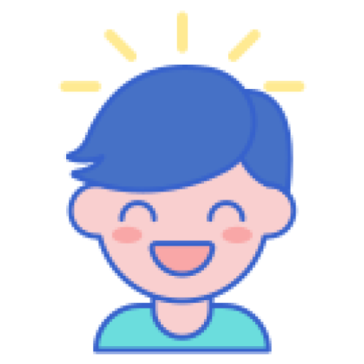
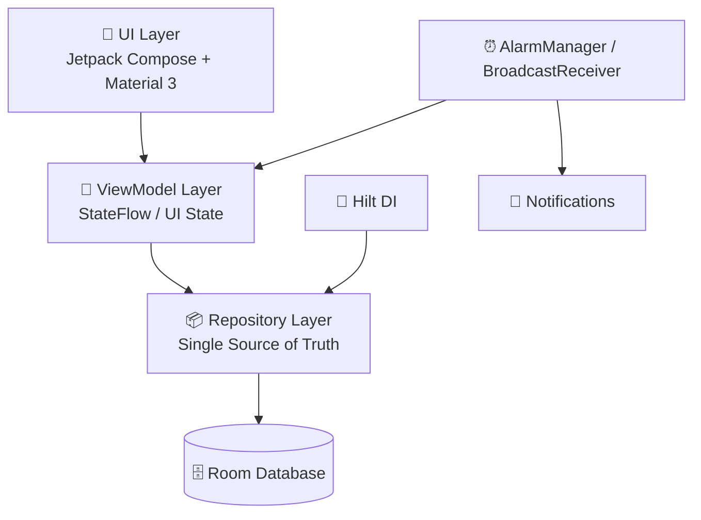

# 🧠 Cerebral Palsy Assistant — Caregiver Companion

<p align="center">
  
</p>

<p align="center">
  <a href="https://cafebazaar.ir/app/com.example.cp?l=en"></a>
  
  
  
  
  
</p>

> **Cerebral Palsy Assistant** is an Android companion application designed to empower caregivers of children with cerebral palsy (CP) with evidence-based knowledge, daily care guidance, and practical self-management tools — so that every child receives consistent, informed care at home between clinical visits.

> 🏥 Developed in collaboration with faculty from **Urmia University of Medical Sciences** across Health Information Management, Medical Informatics, and Pediatric Rehabilitation — a sibling app to [KidsHealth-Constipation](https://github.com/sinaveisi/Child-Constipation-Project-), sharing the same architecture and design philosophy.

---

## ⚠️ Medical Disclaimer

Cerebral Palsy Assistant is an **educational and caregiver-support tool**. It is **not** a medical device, a diagnostic instrument, or a substitute for professional rehabilitation, neurology, or pediatric care. The exercises, positioning techniques, and feeding guidance described here are general recommendations — always follow the individualized plan prescribed by your child's physician, occupational therapist, or physical therapist.

---

## 🌟 Introduction & Philosophy

We believe that the future belongs to the pure hearts of the children of our land.

**Cerebral Palsy Assistant is not your doctor; it is your friend.** A trusted friend that walks alongside families, showing them what they can do day-to-day to support their child's development, comfort, and dignity.

Our mission is to harness information technology and modern communication sciences to play a part — however small — in promoting a self-care culture for families of children with cerebral palsy, and in raising caregiver awareness.

This project was professionally and knowledge-driven, designed and developed with the expertise of esteemed professors from **Urmia University of Medical Sciences** in the fields of:
- Health Information Management
- Medical Informatics
- Pediatric Rehabilitation & Neurology

---

## ✨ Features

| Module | Description |
|---|---|
| 📚 **Educational Content** | Evidence-based modules on understanding CP, motor classification (spastic, dyskinetic, ataxic, mixed), and developmental expectations. |
| 🤸 **Positioning & Handling** | Step-by-step guidance on correct positioning, lifting, carrying, and handling to prevent contractures and promote postural control. |
| 🍽 **Feeding & Nutrition** | Safe feeding techniques, managing swallowing difficulties (dysphagia), and nutritional guidance for children with CP. |
| 🏠 **Daily Living Activities** | Practical advice for bathing, dressing, toileting, and sleep routines adapted for different GMFCS levels. |
| 🎯 **Motor Milestone Tracking** | Track your child's motor development milestones and progress through therapy goals. |
| 💊 **Medication & Therapy Reminders** | Schedule reminders for medications, therapy sessions, and follow-up appointments. |
| 🦷 **Dental & Skin Care** | Specialized care guidance for dental hygiene and pressure-sore prevention in children with limited mobility. |
| ⚠️ **Warning Signs** | Recognize red-flag symptoms that require urgent medical attention (seizures, aspiration, hip dislocation signs). |
| 🔒 **Privacy-First** | All data is stored locally on-device; no data leaves the phone. |

---

## 📸 Screenshots

<p align="center">
  
  
  
  
  
  
  
</p>


---

## 🏗️ Architecture

Cerebral Palsy Assistant follows a **layered MVVM** architecture with a single source of truth in the local Room database and unidirectional data flow through Kotlin `Flow` / `StateFlow`. Built on the modern Android Jetpack stack with Kotlin 2.0 and the Compose Compiler plugin.



---

## 🛠️ Tech Stack

| Category | Technology |
|---|---|
| **Language** | Kotlin 2.0.0 |
| **UI Toolkit** | Jetpack Compose (BOM 2025.06.01) + Material 3 |
| **Architecture** | MVVM + Repository Pattern, Unidirectional Data Flow |
| **Dependency Injection** | Hilt 2.56.1 (with KSP) |
| **Local Database** | Room 2.6.1 (KSP compiler) |
| **Navigation** | Navigation Compose 2.9.0 + Hilt Navigation Compose 1.2.0 |
| **Async** | Kotlin Coroutines & Flow |
| **Build System** | Android Gradle Plugin 8.9.3, Kotlin DSL, Version Catalog (`libs.versions.toml`) |
| **Min SDK / Target SDK** | 26 (Android 8.0) / 35 (Android 15) |
| **JVM Target** | 11 |

---

## 🚀 Getting Started

### Prerequisites

- **Android Studio** 
- **JDK 11+**
- Android device or emulator running **API 26+**

### Build & Run

```bash
# 1. Clone the repository
git clone https://github.com/sinaveisi/cerebral-palsy-Assistant.git
cd cerebral-palsy-Assistant

# 2. Build the debug APK
./gradlew assembleDebug

# 3. Install on a connected device
./gradlew installDebug
```

### Download the released APK

The app is published on the Iranian Android market:

👉 **[Download Cerebral Palsy Assistant from CafeBazaar](https://cafebazaar.ir/app/com.example.cp?l=en)**

---

## 📁 Project Structure

```
app/src/main/java/com/example/cp/
├── MainActivity.kt              # Compose host activity
├── CpApplication.kt             # @HiltAndroidApp
│
├── data/
│   ├── models/                  # Room entities & domain models
│   ├── repository/              # Repository abstraction over DAOs
│   ├── local/                   # Room database & DAOs
│   └── convertor/               # Room TypeConverters
│
├── di/                          # Hilt modules
│
├── ui/
│   ├── screens/                 # Home, Education, Milestones, Reminders
│   ├── components/              # Reusable Compose elements
│   └── theme/                   # Material 3 color & type schemes
│
└── util/                        # Extensions & helpers
```

---

## 📚 References & Medical Sources

The clinical content within this application is informed by standard pediatric rehabilitation references, including:

1. **Nelson Textbook of Pediatrics** (latest edition)
2. Standardized gross motor classification systems (GMFCS)
3. Related research articles published in reputable scientific journals indexed in:
   - Scopus
   - PubMed
   - Web of Science

---


## 📄 Citation

A scientific paper describing the design and caregiver-impact evaluation of this application is in preparation. Once published, please cite it.


> Until then, please cite this repository directly if you reference the project.

---

## 🤝 Contributing

Contributions are welcome — especially around accessibility, localization, and clinical UX. To contribute:

1. Fork the repository
2. Create a feature branch: `git checkout -b feature/your-feature`
3. Commit using [Conventional Commits](https://www.conventionalcommits.org) (`feat:`, `fix:`, `docs:`…)
4. Open a Pull Request describing the change and its rationale

---

## 📜 License

Released under the **MIT License**

---

## 🙏 Acknowledgments

- The children and families who informed the requirements during the design phase
- The faculty and pediatric rehabilitation specialists at **Urmia University of Medical Sciences**

---

## 📫 Contact

**Sina Veisi** — Developer
